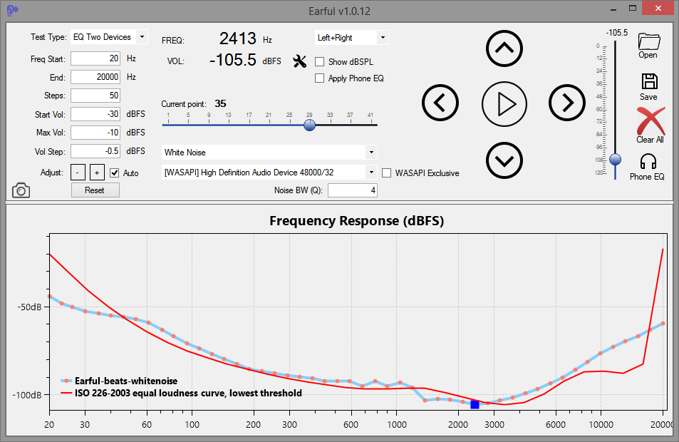

<a href="EarfulSetup.zip">Download Earful for Windows    <input type="image" id="ear" alt="Earful" src="images/earful_logo.png" width="30" align="top" />   </a>

## What is it? And a WARNING!
Earful is an app designed to measure and evaluate the lower threshold of hearing across a frequency spectrum. It is designed to run on Windows and support ASIO, WASAPI, and Direct Sound audio devices. Use with headphones is recommended for greater accuracy and noise elimination.

The app is free to use, but to use it, you must agree to do so *AT YOUR OWN RISK ONLY*. Make sure that the volume settings are set such that any loud sounds played through your system will not damage your equipment or your hearing! This is important. Set the frequency range in Earful correctly, and also specify the maximum volume setting at a low number to avoid surprises (default is -20dBFS).

## Changes in 1.0.2
* The initial public beta release of Earful

___

