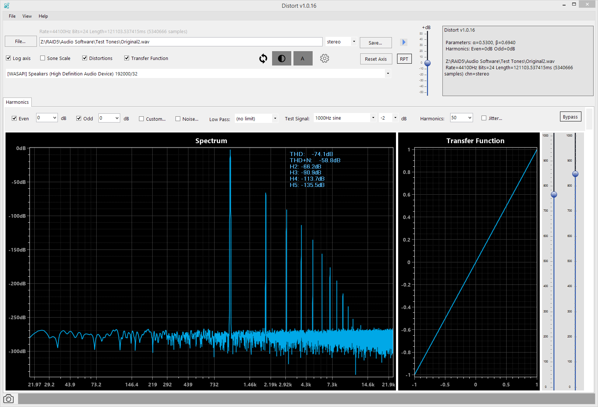
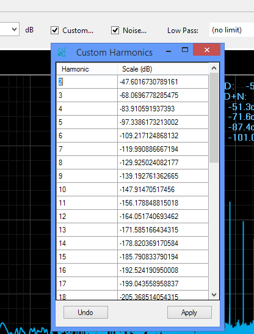
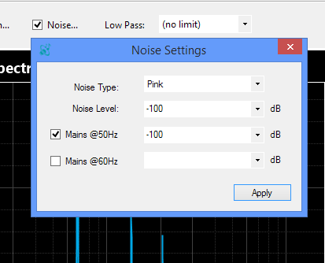
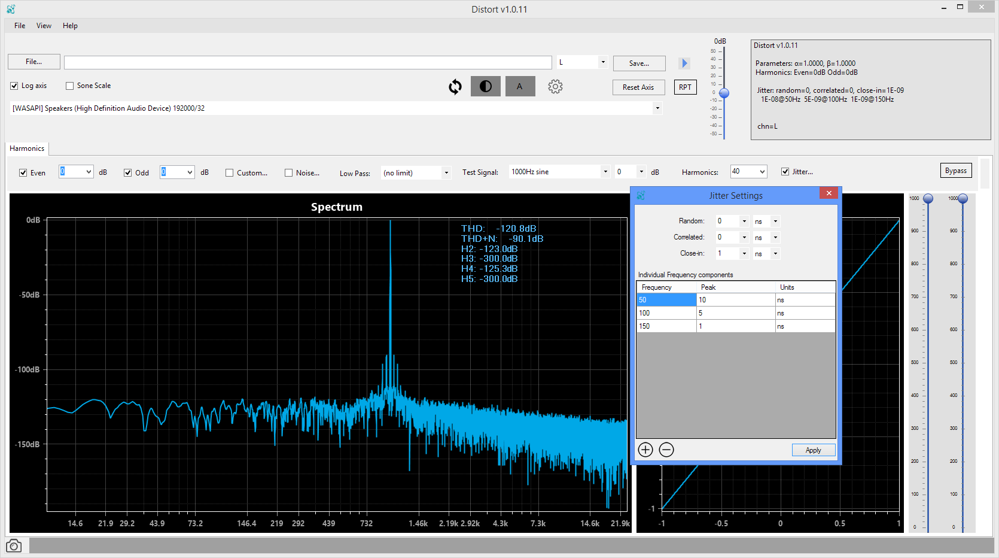

---
# You don't need to edit this file, it's empty on purpose.
# Edit theme's home layout instead if you wanna make some changes
# See: https://jekyllrb.com/docs/themes/#overriding-theme-defaults
sidebar: mydoc_sidebar
layout: "page"
toc: false
title: Distort audibility tester
comments: true
---

 
 

## You may also be interested in these:
* <a href="https://deltaw.org" target="_blank">DeltaWave</a> - Audio null analyzer and audibility tester
* <a href="https://distortaudio.org/earful.html">Earful <input type="image" id="ear" alt="Earful" src="images/earful_logo.png" width="30" align="top" /></a> - An audiophile Hearing Test 
* <a href="https://distortaudio.org/pkharmonic.html">PKHarmonic VST Plugin <input type="image" id="pkharmonic" alt="PKHarmonic" src="images/earful_logo.png" width="30" align="top" /></a> - VST Plugin to add the desired level of 2nd and other harmonics 
 

## Support forum
During the development and beta-testing of DISTORT, you can report issues, ask questions and make suggestions on the ASR forum [here](https://www.audiosciencereview.com/forum/index.php?threads/beta-test-distort-audibility-of-distortions.10163/post-277173).

## What do I need to run Distort?
Distort runs on Microsoft Windows and required .NET 4.6 framework to be installed.
The software is very CPU and memory intensive, recommended configuration at least an I7 4-core processor and 8GB or more of RAM.

## How do I get it?
Here you go:
<a href="DistortSetup.zip">Download v1.0.19 64-bit <input type="image" id="download" alt="Download" src="images/windows-logo.png" width="30" align="top" />   </a>

Please check this website to get an updated copy!

Once the file downloads, extract the installer from ZIP archive and run it to install. Follow prompts.

## What's it good for?

DISTORT was conceived as a tool to allow one to apply a combination of complex distortions to any recorded signal, including music and hires recordings. DISTORT also provides simple visualization tools to examine the effects of all the distortions as they are being adjusted. The distorted sound file can be played through the available audio device drivers, from ASIO to WASAPI to Direct Sound.

The following distortions are currently provided with a variety of settings and options:

* Harmonic distortion (THD, SINAD, THD+N)
* Different noise floors and various spurious noise components, such as mains frequency
* Various types of jitter, random, correlated, 1/f noise, and at various frequencies
* Dynamic range compression effects
* Different types of dither and bit settings
* more to come!

## How do I use it?

Run Distort, pick a WAV file you may want to apply distortion to by clicking on the File: button. 

* Move the sliders on the right up and down to adjust the harmonic level. The first slider (on the left) adjusts the shape of the decreasing amplitude of harmonics. The right slider adjusts the overall amplitude of all the harmonics. Once adjustment is made, it could take a few moments for the charts to refresh.

* You can turn off all odd or all even harmonics by unchecking the appropriate checkbox. Alternatively, you can set the adjustment level to adjust the amplitude of just the odd or just the even harmonics. These settings apply on top of the setting selected using the two sliders.

* If you want to make direct adjustments to harmonics levels, click on the Custom... checkbox and enter the desired dB level for each of the harmonics. When Custom is checked, the settings selected using sliders and odd/even checks are ignored.

* You can also set the desired noise floor. Click on Noise... checkbox to select it. Enter the desired noise floor shape (white or pink) and the desired level in dB. Press Apply to see the changes reflected on the plots. You can also add a 50Hz or 60Hz mains frequency spike at the desired level. Noise floor settings apply in addition to all other harmonics settings.

* When the desired look and level of THD, THD+N and harmonics is achieved, you can press the Play button to hear the distorted file you picked through the audio system connected to your PC, or you can click Save to write the file out to disk, with all the distortions already applied.

* If desired, you can also pick a low pass filter frequency. This is to eliminate the effect of harmonic distortion beyond audible frequencies, say above 20kHz. This filter is applied only when saving a file, not when playing it.

* New in 1.0.11 you can combine any of the above settings with customized jitter values

## What's new in...

### v1.0.19
* Added negative feedback setting
* Fixed right channel scaling when saving distorted file to match the left channel

### v1.0.18
* Added a number of simulated transfer functions for various tube (pre)amps
* Added a tab to display the shape of the waveforms, original, undistorted and the distorted one

### v1.0.17
* Added Bits tab to select dither type (none, TPDF, and Shaped) and to select the number of bits to dither
* Added configurable Dynamic Range Compression distortion to Custom Transfer Function settings
* Added Noise Floor setting (no signal) to the available Test Signals
* Added Blue and Violet noise floor settings
* Minor bug fixes

### v1.0.16
* Added an option to hide THD legend on the spectrum plot
* Added an option to hide the transfer function plot
* Fixed a rare out-of-bounds condition when using jitter settings
* Save Reference file menu now saves stereo when two channel option is selected
* Added an option to dither the result to a specific number of bits

### v1.0.15
* Fixed custom harmonics table to show harmonic 2 on row 2, instead of 3
* Changed the WASAPI driver supported audio bits and rate setting determination logic

### v1.0.14
* Added custom sine-wave components to the Noise settings window. Supports frequencies into MHz
* Improved quality of the close-in (1/f) jitter generator
* Added square wave to the list of test signals
* Double-click on the either of the two vertical sliders (alpha and beta) resets them to the initial setting of 1000
* Quicker reaction to user-initiated changes to settings, even while a computation is already in progress
* Improved frequency plot resolution from around -150dB to better than -280dB
* Added clipping indicator when combined noise/jitter/waveforms exceed -1..1 sample range
* Improved THD+N calculation accuracy

### v1.0.13
* Fixed multitone display not switching to 1kHz test tone
* Fixed L/R/Stereo selector not having an effect until after restart
* Validating the # of allowed Harmonics to be 7..500 instead of 1..500
* Added clear and reset to main window buttons to Custom Harmonics screen
* Extrapolate button should work now in Custom Harmonics to fill in missing values
* Double-click on volume control now resets it 0dB

### v1.0.12
* Jitter sine components table now supports fractional frequencies
* Fixed the missing down-arrow for some frequency components in jitter settings

### v1.0.11
* Added Jitter distortion (random, correlated, close-in and multi-frequency sine-modulated)
* Added RPT function to repeat playback from start
* Volume control now applies separately (and is remembered) for Bypass and non-Bypass playback, so each can be controlled independently
* Fixed Mains frequency to display at 50 and 60Hz, previously displayed as a 3x multiple
* Added a few more test frequencies useful for testing harmonics and jitter
* App will load faster after it's used for the first time now. Previously took a long time load each time it was started.
* (EXPERIMENTAL) added Sone scale (perceptually-weighted). This will likely disappear in the next release

### v1.0.10
* Added option to chose the number of generated harmonics, from 1 to 500
* Added 20Hz and 32 multi-tone test signals

### v1.0.9
* Enhancement to improve handling of THD/THD+N and harmonics calculations with smaller FFT sizes

### v1.0.8
* Fix for 50Hz/60Hz/12000Hz test signals not working

### v1.0.7
* Added support for DirectSound playback (any \[DS\] drivers in the driver list)
* Added input validation on Noise Settings form
* Changed default values for both, Noise Settings and Custom Harmonics to -300dB from 0

### v1.0.6
* Added additional single and dual tone display options
* Fixed reported error when no audio driver is selected
* Fixed reported issue when an audio driver claims to support more bits than it can handle
* Save... dialog now remembers previous directory

### v1.0.5
* Added ability to save and reload distortion settings from a file
* Added brown noise floor option (-6dB/octave)

___

