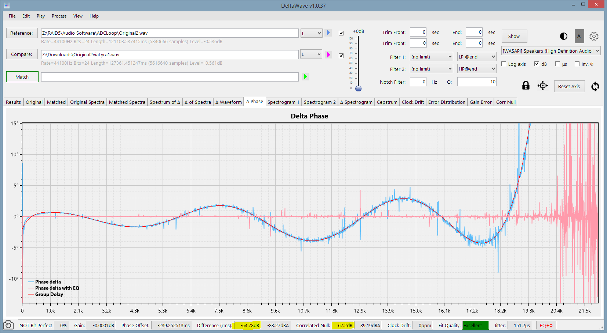
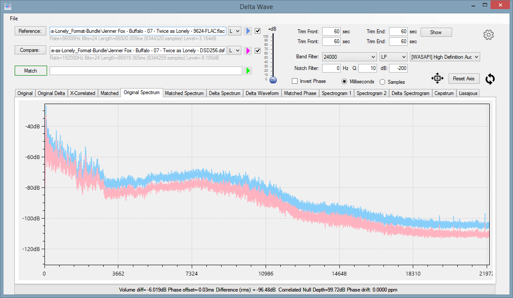
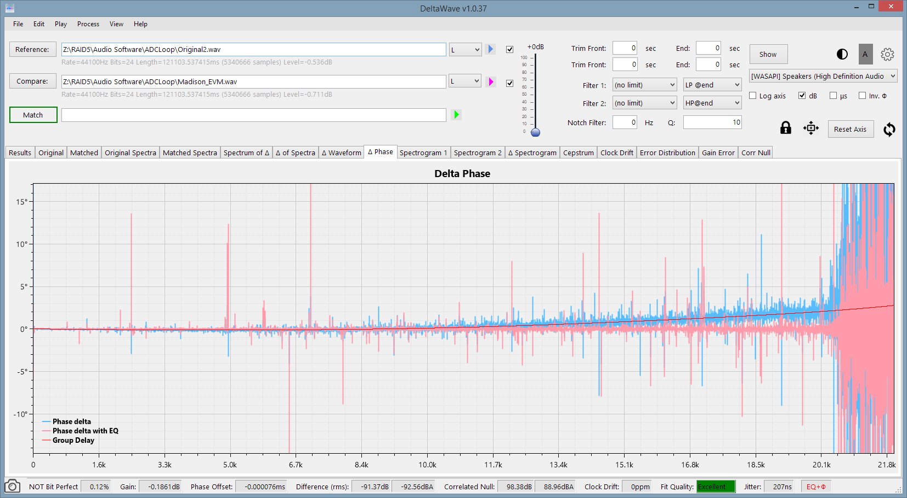

---
# You don't need to edit this file, it's empty on purpose.
# Edit theme's home layout instead if you wanna make some changes
# See: https://jekyllrb.com/docs/themes/#overriding-theme-defaults
sidebar: mydoc_sidebar
layout: "page"
toc: false
title: DeltaWave Audio Null Comparator
comments: true
---

## <a href="DeltaWaveSetup.zip">Download 64-bit  <input type="image" id="download" alt="Download" src="images/windows-logo.png" width="30" align="top">   </a>

[Release notes](pages/mydoc/release_notes_1.0b.md)

This is an early beta version of the software. Please check this website before then to get an updated copy!


