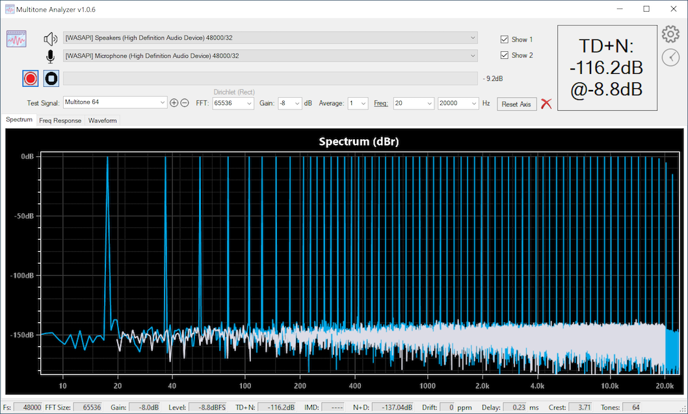
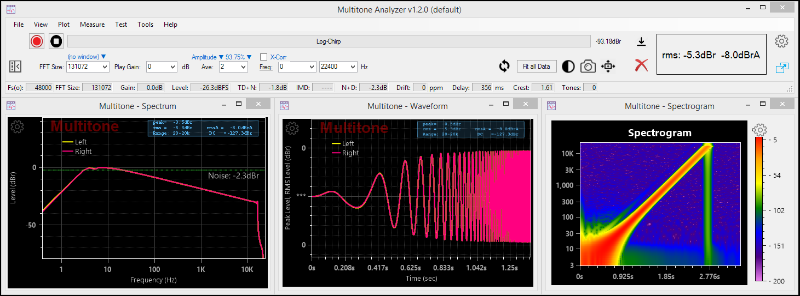
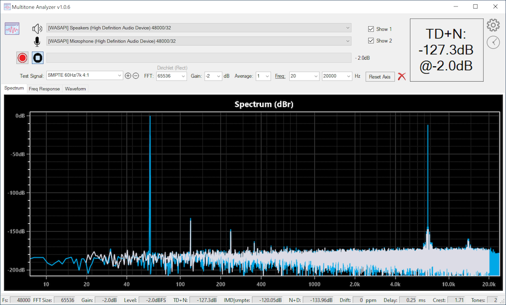
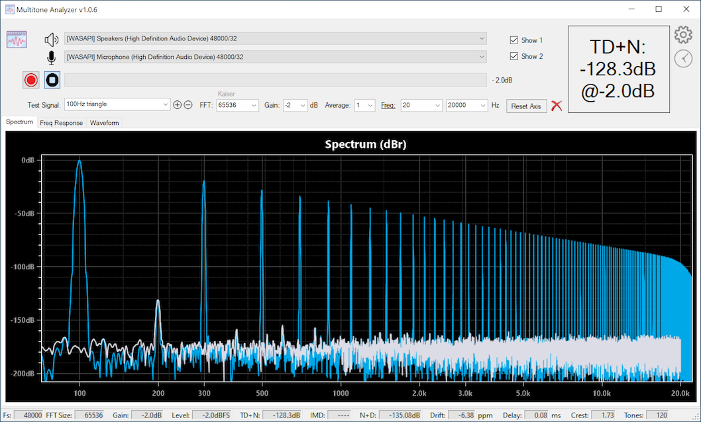
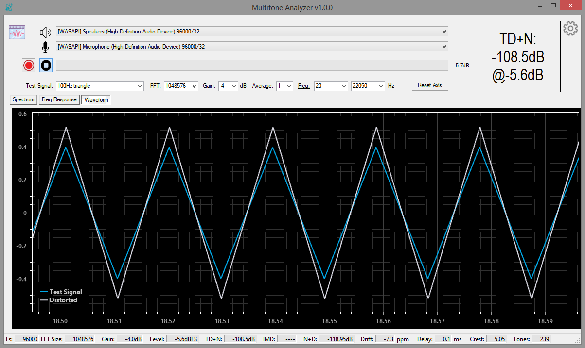
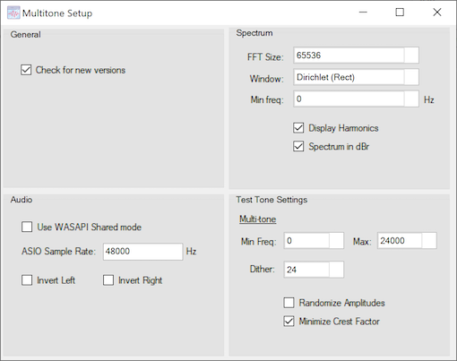
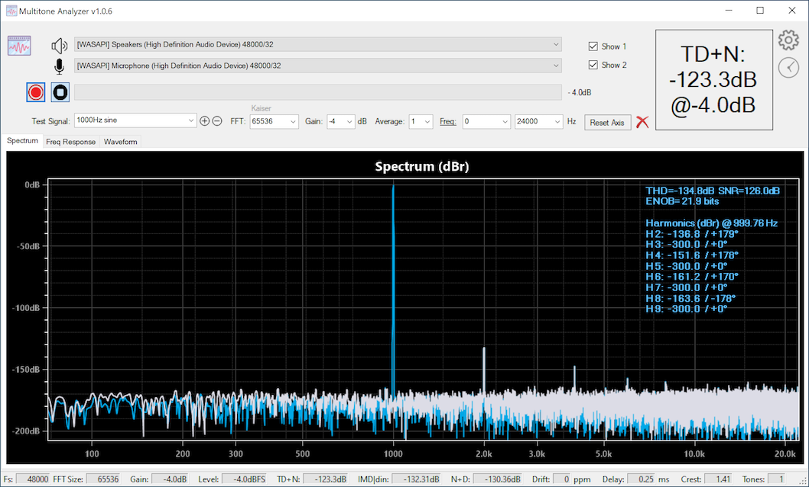

<br>
<br>

## Download Multitone
<a href="MultitoneSetup.zip">Download Multitone for 64-bit Windows v1.2.8  &nbsp;&nbsp; <input type="image" id="ma" alt="Multitone" src="images/multitone_logo.png" width="30" align="top" />   </a>

<input type="hidden" id="version" name="version" value="1.2.8"/>


## You may also be interested in these:
* <a href="https://deltaw.org" target="_blank">DeltaWave</a> - Audio null analyzer and audibility tester
* <a href="https://distortaudio.org" target="_blank">DISTORT</a> - Your personal simulation of what various distortions do to audio
* <a href="https://distortaudio.org/pkharmonic.html">PKHarmonic VST Plugin </a> - VST Plugin to add the desired level of 2nd and other harmonics 
* <a href="https://distortaudio.org/earful.html">Earful </a> - An audiophile Hearing Test
<br>

## Support forum
During the development and beta-testing of Multitone Analyzer, you can report issues, ask questions and make suggestions on the ASR forum [here](https://www.audiosciencereview.com/forum/index.php?threads/beta-test-multitone-loopback-analyzer-software.27844/).

## What is it?
Multitone Analyzer is an app designed to explore audio electronics performance by producing quick measurements using a simple loop-back configuration. MA produces a specific set of test tones that are sent to a digital-to-analog converter (DAC) that are then passed through one or more analog components and then received by MA and analyzed. MA both, plays the signals and records them for analysis. DAC and ADC are required for this to work.

* Measurements that MA can produce: TD+N, IMD, N+D, delay, clock drift, frequency response, etc.
* Audio support for WASAPI, ASIO, and Direct Audio devices with sampling rates of up to 384kHz/32 bits
* Test signals: arbitrarily large multi-tone signal, simple sine waves, two-tone IMD test signals, 3-tone IMD test signals, square wave, triangle wave
* FFT sizes of up to 1M
* For distortion measurements a range of frequencies to measure can be selected

## How <u>not</u> to use it!
Don't use this with your speakers or headphones! The test signals are designed for electronic device testing only, and levels and frequencies of the test can be enough to cause damage to the equipment, or worse yet, your ears. Be warned!

## How to use it
* Make sure a DAC and an ADC are connected and working with the PC running Multitone Analyzer. Connect the DAC output to another device you want to test, and then connect the output of that (or the output of the DAC) to the input of the ADC
* Select the correct devices from the two drop-down lists at the top of MA screen
* Select the desired test signal, pick a level and press the red record button
* Let Multitone Analyzer do the rest. The sequence will be Generate, Record, and then Process. Results will be displayed when the recorded signal is captured and analyzed
* Starting in version 1.0.60 -- use preconfigured measurement settings (presets) to perform complex measurements with one click, with no need for changing settings



## A few things to know
1. All the lists and drop-downs on the main MA screen are editable. You can change frequencies, amplitude ranges, or type in frequencies that are not already in the drop down. In effect, you can create completely new tests consisting of different tone combinations.
2. The little gear button at top right provides a few useful settings and is worth checking out
3. If you're familiar with my DeltaWave or Distort apps, you can use the same key and mouse combinations in the charts to zoom-in, pan around, or even draw your own annotations
4. Larger FFT sizes might take a bit of time to generate the first time you use them. Be patient the very first time, as the next time you use the same FFT size, it will go a lot quicker. This is true even after you close and restart MA, or even restart your computer. It'll be a bit slow the very first time.
5. Both, DAC and ADC must use the same sampling rate. Make sure you configure this in Windows audio device settings. MA will detect the correct sampling rate for the device and use it for WASAPI devices. For ASIO devices, please set the desired sampling rate in settings, under the gear icon.





## Tips to make it work better
1. Larger FFT sizes are necessary for higher resolution frequency analysis. This is especially true for multi-tone testing. If the tones in the result are overlapping, touching, or look deformed, increase FFT size to make sure they are properly resolved. For anything more than 10 tone signal, I recommend using 1M FFT
2. Larger sampling rates will take time to capture signal when processing with the same FFT size. 96kHz capture will be twice as fast as 48kHz capture. Larger FFT sizes will generate and record a longer test signal than shorter FFT sizes.
3. If you're not in a rush, it's nearly always better to set the FFT size to the largest available
4. The Frequency Response chart is only generated with large-size multi-tone test signals (greater than 5 tones). It will be blank for all other test signals.




## Adding custom test signals
You can design a completely custom test signal by just editing in the parameters on the MA main window. To save the new test, press the + button next to the edit box. The test will be available next time you restart Multitone Analyzer, just pick it from the drop-down list. If you need to remove a previously saved custom test, select it from the list and click the '-' button next to the edit box.

The test tone specification format is fairly simple: test name, followed by one or more frequencies, optionally followed by amplitude ratios.

The name of new test signal must contain no spaces. Frequency can be entered using Hz or kHz or k as a suffix: for example 100Hz, 0.1kHz, or 0.1k are all equivalent. If a modifier is omitted, Hz is assumed.

### Modifying existing test signals
You can change the parameters of any of the existing test signals and save that as a new test.

For example, starting with ``Multitone 32``, you can change it to ``Multitone 55``. The name of the signal, Multitone, must not be changed in this case but you can change the number of tones to any desired value.

Or, starting with ``SMPTE 60Hz/7k 4:1`` you can modify the two frequencies or the amplitude ratios to produce new test signals. Or you can even add another frequency or two into the mix.

```
SMPTE 100Hz/7.123k 4:1
SMPTE 25Hz/7k 5:1
SMPTE 30/60/1k/7k/13k 4:4:1:1
etc.
```
Similarly, you can modify the standard DIN tests:

```
DIN 300Hz/7k 4:1
DIN 250/1k/7k 4:1:1
```

### A single sinewave at a specific frequency

Format: ``Name freq``

Examples:

```
Sin_100hz 100
MySine 100Hz
NewTest 15kHz
Test_15k 15k
```

### Multiple sinewaves

Multiple sine frequencies can be specified by separataing them with a forward slash:

Format: ``Name freq1/freq2/.../freqN``

If you want to change the amplitude ratios between the multiple frequencies, these can be added after the frequency list, separated by ':'

Format: ``Name freq1/freq2/.../freqN ratio1:ratio2:...:ratioN``

Ratio 4:1 for example specifies that the first sinewave will have 4x the amplitude of the second one. If ratios are omitted, all sinewaves specified will have the same amplitudes (equivalent to 1:1:...:1)

Examples:

```
MT_Test1 100Hz/13kHz
MT_Test2 20/100/13k/13.1k/15k
MT_Test3 100Hz/13kHz 4:1
MT_Test4 20/100/13k/13.1k/15k 1:4:1:1:1
```

### Adding a square wave
You can specify *at most one* square wave frequency in your test signal. This is done by preceding the very first frequency with 'sq:'. One square wave can be mixed with multiple sinewaves, if desired.

Examples:
```
SQT_OneSqWave sq:100.5Hz
SQT_OneSqWave_and_3_sines sq:100/13k/13.1k/15k
SQT_Test3 sq:1000Hz/13kHz 4:1
SQT_Test4 20/100/13k/13.1k/15k 1:4:1:1:1
```

## Configuring variable expressions
Multitone 1.0.49 introduced the ability to customize title and results display with your own calculations and formatting. This feature is documented <a href="https://distortaudio.org/multitone-exp.html">here</a>.

<br>


## Changes in 1.2.8
* Change: remove spikes and artifacts at the end of a capture caused by device or audio driver
* Change: improve zooming behavior on level and frequency sweep charts during capture
* Change: improve calibration file handling by removing auto-scaling
* Fix: level sweep plot could occasionally lose one of the measured lines when returning from another plot
* Fix: spectrum plot distortion panel not shown when captured from another tab
* Change: improved multitone notch filter design to handle wide-skirted fundamentals

## Changes in 1.2.5  
(<a href="https://www.audiosciencereview.com/forum/index.php?threads/beta-test-multitone-loopback-analyzer-software.27844/post-2220210">ASR tests and discussion</a>)
* Add: Floating/detached measurement plots with magnetic borders
* Add: Collapsible header portion of the main window
* Add: Cross-correlation averaging option to lower the effect of ADC noise on measurements
* Add: DC filter measurement option will lower the effect of the DC offset in measured data
* Add: Clock drift correction setting to eliminate measured clock drift due to independent clocks in the DAC and ADC
* Change: IMD calculation improvements, real-time IMD display during capture, and IMD calculated with multitones up to 1024 tones
* Change: IMD+N calculation now shows the true sum of IMD and noise components
* Change: SFDR calculation now ignores DC component, even if included by measurement bandwidth
* Fix: occasional errors with large multitone signals
* Fix: minor display errors

## Changes in 1.1.12
* Add: Periodic or manual interval sweep
* Change: reduce CPU load during measurements
* Fix: oscilloscope view jerkiness reduced
* Fix: counter starts at 0 not 1 in sweeps
* Fix: interval can vary by a lot between successive captures
* Fix: the Y-axis label overlap on Waveform plot
* Fix: the discontinuity at the end of a Native DSD measurement
* Fix: an issue with the final measurement results not being computed properly when the preview option is turned off in settings

## Changes in 1.1.10
* Add: Noise floor display in Spectrum plot selected by 'Show Noise Floor' setting
* Change: clock drift calculation now works with a single tone and multi-tone test signals
* Add: spectrum range display shows min and max values for all frequencies when spectrum is computed from averaged data
* Add: IMD+N variable to Level and Frequency sweeps
* Add: color selector property for 3rd measurement in Level and Frequency sweeps
* Add: option to position distortion panel on the left, in the center, or to the right (default)
* Add: line color indicators next to the Show 1 and Show 2 checkboxes are now clickable so you can change colors directly there, without opening the properties sheet
* Fix: color indicators are now shown on start up (previously were invisible until first measurement)
* Add: various useful settings to both sweep property sheets
* Fix: in sweeps retry setting of 0 will no longer display a prompt when a large error occurs, effectively disabling retries
* Add: retry measurement setting (number of retries, and TD+N difference from the previous result that causes it)
* Add: third measurement to the plot, allowing up to three different variables to be compared
* Add: harmonics 2,3,4, and 5 to the list of variables that can be plotted in sweeps
* Add: support for custom expressions/computations to be used in place of pre-defined plot variables
* Add: DSD modulator order setting for generating DSD test signals (4 - 7)
* Change: removed clipboard zoom level setting from the Specturm Chart properties window

## Changes in 1.1.7
* Add: Option to change level sweep view from measured level to generated level
* Change: Improved switching of units and other settings on Frequency and level sweep plots

## Changes in 1.1.6
* Add: frequency calibration file generation and export (File->Export Measurement -> Frequency Response as Text... menu)
* Fix: N+D calculation did not use AES17 notch when one was selected
* Change: MTA notch (non-AES17) changed to be more aggressive to accomodate wider and more chaotic skirts around the fundamental
* Add: setting to enable/disable phase unwrapping in phase plot
* Change: DSD upsampling filter is now increased automatically with larger DSD multipliers to eliminate images above Nyquist


## Changes in 1.1.2
* Add: Wow and Flutter measurements for LPs and tapes,  drift vs frequency plot
* Change: DC is now ignored if included in the measurement bandwidth for all noise, TD+N, THD, SNR measurements
* Change: FFT size selector is no longer changed automatically to match sample rate. Any FFT size can be selected for any rate
* Fix: Zoom dialog scale didn't work correctly for plots from history
* Fix: Plots with ASD/√Hz units enabled now display correctly
* Fix: Incorrectly entered play gain will display an error message and default to -300dBFS. Was 0dBFS previously
* Fix: Calibration file applied to a measurement in history will be used correctly when a plot is displayed for that entry
* Fix: WAV File... test prompting for file selection more than once when invoked from menu

## Changes in 1.0.99
* Add: support for Native DSD output on ASIO, up to 1024x48kHz sample rates
* Fix: CSV spectrum file export to use US decimal point notation for locales where comma is used
* Fix: two channel ASIO output with multi-channel devices playing on all available channels
* Fix: recording wasn't working from higher level channels, now works up to 128 channels, with any two consecutive channels being recorded
* Change: the mouse coordinate tracker display is moved further up so as to not obscure where the mouse is pointing
* Add: the option to display THD panel with or without the list of harmonics
* Fix: the save plot image option reversing PNG and JPEG image formats

**Changes in 1.0.97**
* Fix: regression from .96 - fix H1 display value
* Change: additional speed-up of preview calculations to further improve latency
* Fix: dither setting wasn't being applied with certain WASAPI drivers
* Fix: NaN displayed for Jitter RMS value (J-rms) when 0 jitter was detected
* Fix: regression from .96 - level and frequency sweeps showed incorrect results after the first 1-2 points

**Changes in 1.0.96**
* Fix: regression from 0.95 - measurement results changed depending on the number of averages specified
  
**Changes in 1.0.95**
* Fix: preview spectrum window jumping during capture
* Fix: preview spectrum window jumping at the end of capture
* Change: clearing all samples captured after the end of test signal to make sure only test signal itself is used for display/analysis
* Change: Optimized CPU utilization and decreased time needed to process preview FFT window and preview Spectrum during capture
* Fix: H1 value in the distortion panel was always shown in dBFS, even when dBr units were selected

**Changes in 1.0.91**
* Fix: regression from .90 - A-Weighted noise (NoiseA) was displaying unweighted noise in distortion panel
* Change: Added Frequency column to the exported Spectrum CSV file

**Changes in 1.0.90**
* Add: export Spectrum as CSV file menu option
* Change: enhancements to dither algorithm when writing test signal files and playing back using ASIO and WASAPI
* Change: reduce the need for larger ASIO buffers, reduce latency
* Add: additional display parameters to the THD/IMD panels and rearranged items in the display
* Fix: small bug in transfer function generator (last specified harmonic in the list was skipped)
* Fix: enable support for up to 128 ASIO channels in and out
* Add: synthetic test <a href="https://distortaudio.org/Multitone Tests 1_0b.pdf">files and results</a> for Multitone and REW

**Changes in 1.0.87**
* Add: Prevent computer from sleeping while running a long test
* Add: "Hide small harmonics" option to not include any harmonics in the display that are below noise floor
* Add: external file tone detection threshold settings to allow for measuring high-distortion devices, such as turntable cartridges
* Add: noise level specification in transfer function window
* Change: when using external source or doing a measurement from a file, the recorder channel setting ("L", "R", "L+R") will now be honored. Previously all 2 channel files were processed with both channels, regardless of this setting
* Change: Rework and simplification of the noise calculation
* Fix: some settings on the main window might reset to older values when a new measurement is initiated (FFT size, # of averages, etc.)

**Changes in 1.0.84**
* Add: Spectrogram plot and tab

**Changes in 1.0.83**
* Add: Setting to increase Multitone process CPU priority when performing measurements

**Changes in 1.0.82**
* Change: Multitone generation with decoherent setting will now produce a more dense set of tones in the lower frequencies
* Add: setting for Phase plot display to remove constant group delay
* Fix: phase plot result showed absolute phase reversed

**Changes in 1.0.80**
* Add: HTML files with tables generated for each step, group or sweep in the test plan, with detailed results
* Add: Cool-down threshold setting to allow cool-down period to be observed only above certain measured RMS value
* Add: Option to turn off individual sample markers in Waveform and Sweep plots
* Add: Measurement duplicate button in Test Plan editor window
* Change: test plan execution window now support selecting one or more individual measurements to perform
* Change: FM test signals now support exact/fractional frequencies and phase specification using '@'
* Fix: occasional window resize/reposition after a test plan completes


**Changes in 1.0.79**
* Add: group plots in test plan by specifying Plot Group and Group Plot label
* Add: zoom-in and out using scroll-bars in the zoom window
* Fix: regression from .78: linearity sweep was broken due to new fractional frequency logic
* Fix: window position can change during test plan execution if window was moved during plan creation

**Changes in 1.0.78**
* Fix: noise and SNR calculations (were +3dB previously)
* Fix: DIM 30/100 test signal specification (and others) that include a decimal point didn't work with some regional settings using comma
* Change: test signals that include a phase specification will now use the exact frequency and not one centered on an FFT bin (1khz@45, for example)

**Changes in 1.0.77**
* Fix: square wave measurements regression
* Add: support for custom setting note in plot image capture/save and as part of test measurement
* Add: Intersample over test presets @ 44.1k
* Add: sinc interpolation option to test plan settings under Chart section
* Fix: sinc interpolation didn't scale properly in the waveform plot when Fs-in didn't equal Fs-out

**Changes in 1.0.76**
* Fix: reported issues with Test Plan editing/execution
* Add: Pause message before and after test step execution, fit all data option, {testName} variable
* Add: watermark setting
* Add: DIM 30, DIM 100, CEA2006/CE2010/EAJ Burst signals
* Add: Log-time axis plot

**Changes in 1.0.75**
* Add: Test Plan edit and execution
* Fix: level sweep X-axis labeling when measured in units other than dBFS/dBr
* Change: ASIO device driver that's not available or not working will be shown in red when selected

** Changes in 1.0.74**
* Add: ability to change units (dBFS/dBr/V/W/dBW/dBV) in level sweep horizontal (X) axis
* Add: save and restore level and frequency sweeps from history
* Change: level sweep horizontal axis to use log spacing with non-dB units
* Change: level sweep horizontal axis to show measured (input) RMS values instead of generated
* Fix: ASIO drivers could throw an exception when playback is stopped
* Fix: IMD calculation for two or more tones
* Change: TIM test signals will now use DIN IMD calculation method (ref. last tone)

**Changes in 1.0.71**
* Add: support for phase specification in test signal format (for example, 1kHz@90)
* Add: ability to unlock aspect ratio when copying plot to clipboard or saving to file
* Add: measurement bandwidth controls (low/high) under Measurement settings to separate measurement from display bandwidths
* Change: better labels selection for linear frequency axis
* Change: add a significant digit to frequency axis labels
* Change: bandwidth selector changed to work consistently across all chart types
* Change: allow mixing of different sampling rates and FFT sizes from history on the same plot
* Change: multitone IMD calculation switched to using CCIF method. Previously the default was SMPTE
* Change: new property section created 'Device', with in/out device settings moved to it from Test Signal
* Change: number tracker display always uses black text on light blue background now, regardless of contrast setting
* Fix: certain test signals exceeding 0dBFS previously would result in a missing fundamental, now clipped to 0dBFS
* Fix: IMD, Noise, SNR calculations didn't work correctly with variable amplitude multitones (e.g., FM signals)


**Changes in 1.0.67**
* Add: Frequency response/phase/Impulse response analysis from noise signals
* Add: History selecton now updates FR/phase/IR plots
* Add: History now allows measurements to be overlayed even those produced using different FFT sizes
* Add: Mouse movement over the curve in any of the plots will automatically display the X and Y values for that point
* Add: Linear-Chirp test signal
* Add: additional position selector options for placing the legend on the plot
* Fix: Warm-up now works correctly with chirps and noise signals
* Fix: periodic noise generation (white and pink + bandlimited) corrected


**Changes in 1.0.65**
* Add: Log-Chirp test signal
* Add: Impulse Response measurement plot from Log-Chirp
* Add: Frequency and Phase response computation from Log-Chirp
* Add: Frequency Response (log-chirp) and Impulse Response (log-chirp) presets
* Add: Voltage calibration pop-up window
* Add: Test signal export to a file window with choice of bits, sample rate, duration, and channels to include
* Add: Right-click in the plot area brings up a menu to hide/show/delete individual elements
* Add: Clipboard and File image capture with options window added with support for JPEG, PNG, and SVG file formats
* Add: Continuous signal generation by clicking on the speaker icon
* Add: Menu bar at the top of the window to simplify discovery and access to many features, some accelerator keys added
* Add: Support for 16-bit WASAPI drivers
* Add: Color assigned to channel 1 and 2 shown next to the Show 1 and 2 checkboxes
* Add: Color selector for Measurements 1 and 2
* Change: Recording start/stop behavior to capture as much of the test tone as possible
* Change: history checkbox now adds both channels to the plot if two channel signal was recorded
* Change: drag and drop a WAV file for measurement can now be dropped on the Spectrum plot for analysis
* Change: Multitone high/low frequency selector, also used for Log-Chirp and Noise generators is now moved to Test Signal section


**Changes in 1.0.60**
* Add: Multiple measurement presets preconfigured for specific types of measurements, one-click selection of all the settings
* Add: Custom transfer function configuration with harmonic frequency and phase selector for generating specific distortions
* Add: table viewer and exporter for frequency and level sweep results
* Add: RIAA anti-correction for measuring RIAA equipped devices, such as phono stages
* Change: IMD calculation to work faster with larger multitones
* Change: Multitone logo added to the top of plots
* Fix: invert channel option didn't invert
* Fix: summary measurement settings text was missing from plot image when copied to clipboard


**Changes in 1.0.57**
* Add: Jitter Peak and RMS measurements (as results variable, in the distortion display and in sweep plot variable selection)
* Add: Information panel with random signals
* Change: additional FFT sizes in the drop-down list (start with 4k)
* Add: Zoom window for manual plot adjustments
  

**Changes in 1.0.56**
* Add: RMS and RMS(A) result display
* Add: IMD (multitone) distortion panel that includes TD+N, SFDR, Noise, IMD, ENOB and other results
* Fix: Missing information text on copy plot to clipboard
* Change: backround display for the distortion information panel
* Change: auto-adjust result button display to fit all the text
* Change: Improved IMD calculation now works with multitones with up to 64 tones (was max of 5 previously)


**Changes in 1.0.55**
* Add: support for measuring difference between two channels ("L-R" input selector). Added to spectrum, frequency response, phase, and waveform plots

**Changes in 1.0.54**
* Change: improved method to find the initial sample alignment between test signal and captured waveform
* Change: THD/distortion panel now shows THD relative to the fundamental, regardless of the selected units
* Fix: calibration file was not applied in spectrum plot after capture
* Fix: phase plot custom titles not preserved after measurement

**Changes in 1.0.53**
* Add: support for DSD test signal playback over DOP, supporting DSD64, DSD128, DSD256
* Add: phase plot, calculated when using multitone test signals and the same ADC/DAC sample rate
* Add: Higher sampling rates up to 768k (possibly higher, if your device(s) support it)
* Add: File drag-and-drop (on test signal drop-down) feature to measure files without DAC/ADC loopback
* Fix: when displaying spectrum captured in stereo mode, show full bandwidth of the captured signal


___

