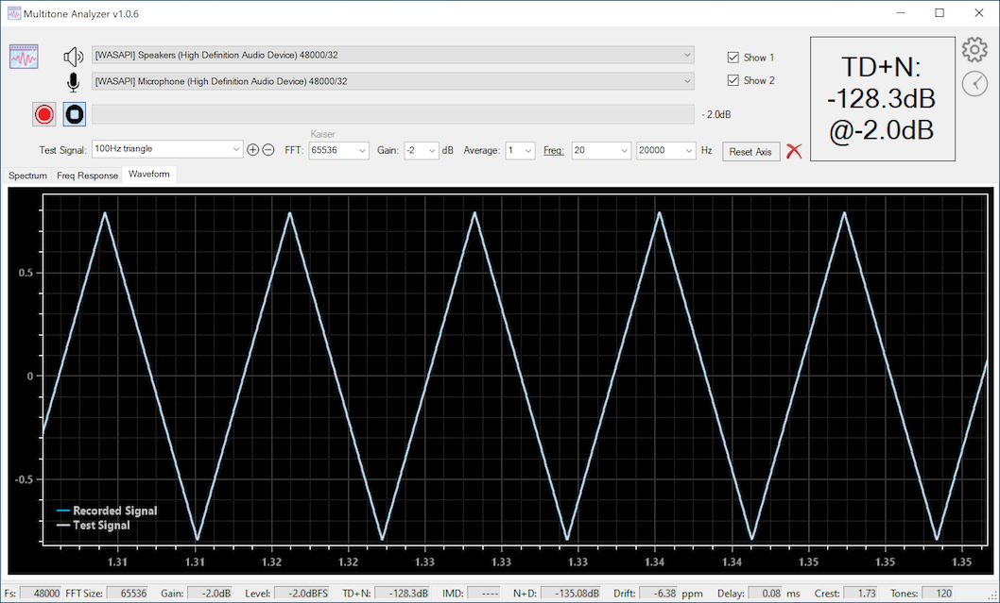

 
 

<a href="MultitoneSetup.zip">Download Multitone for 64-bit Windows v1.0.2   <input type="image" id="ma" alt="Multitone" src="images/multitone_logo.png" width="30" align="top" />   </a>

<input type="hidden" id="version" name="version" value="1.0.2">

## You may also be interested in these:
* <a href="https://deltaw.org" target="_blank">DeltaWave</a> - Audio null analyzer and audibility tester
* <a href="https://distortaudio.org" target="_blank">DISTORT</a> - Your personal simulation of what various distortions do to audio
* <a href="https://distortaudio.org/pkharmonic.html">PKHarmonic VST Plugin </a> - VST Plugin to add the desired level of 2nd and other harmonics 
* <a href="https://distortaudio.org/earful.html">Earful </a> - An audiophile Hearing Test 
 

## Support forum
During the development and beta-testing of Multitone Analyzer, you can report issues, ask questions and make suggestions on the ASR forum [here](https://www.audiosciencereview.com/forum/index.php?threads/beta-test-multitone-loopback-analyzer-software.27844/).

## What is it?
Multitone Analyzer is an app designed to explore audio electronics performance by producing quick measurements using a simple loop-back configuration. MA produces a specific set of test tones that are sent to a digital-to-analog converter (DAC) that are then passed through one or more analog components and then received by MA and analyzed. MA both, plays the signals and records them for analysis. DAC and ADC are required for this to work.

* Measurements that MA can produce: TD+N, IMD, N+D, delay, clock drift, frequency response, etc.
* Audio support for WASAPI, ASIO, and Direct Audio devices with sampling rates of up to 384kHz/32 bits
* Test signals: arbitrarily large multi-tone signal, simple sine waves, two-tone IMD test signals, 3-tone IMD test signals, square wave, triangle wave
* FFT sizes of up to 1M
* For distortion measurements a range of frequencies to measure can be selected

## How not to use it!
Don't use this with your speakers or headphones! The test signals are designed for electronic device testing only, and levels and frequencies of the test can be enough to cause damage to the equipment, or worse yet, your ears. Be warned!

## How to use it
* Make sure a DAC and an ADC are connected and working with the PC running Multitone Analyzer. Connect the DAC output to another device you want to test, and then connect the output of that (or the output of the DAC) to the input of the ADC
* Select the correct devices from the two drop-down lists at the top of MA screen
* Select the desired test signal, pick a level and press the red record button
* Let Multitone Analyzer do the rest. The sequence will be Generate, Record, and then Process. Results will be displayed when the recorded signal is captured and analyzed

## A few things to know
1. All the lists and drop-downs on the main MA screen are editable. You can change frequencies, amplitude ranges, or type in frequencies that are not already in the drop down. In effect, you can create completely new tests consisting of different tone combinations.
2. The little gear button at top right provides a few useful settings and is worth checking out
3. If you're familiar with my DeltaWave or Distort apps, you can use the same key and mouse combinations in the charts to zoom-in, pan around, or even draw your own annotations
4. Larger FFT sizes might take a bit of time to generate the first time you use them. Be patient the very first time, as the next time you use the same FFT size, it will go a lot quicker. This is true even after you close and restart MA, or even restart your computer. It'll be a bit slow the very first time.
5. Both, DAC and ADC must use the same sampling rate. Make sure you configure this in Windows audio device settings. MA will detect the correct sampling rate for the device and use it for WASAPI devices. For ASIO devices, please set the desired sampling rate in settings, under the gear icon.

## Tips to make it work better
1. Larger FFT sizes are necessary for higher resolution frequency analysis. This is especially true for multi-tone testing. If the tones in the result are overlapping, touching, or look deformed, increase FFT size to make sure they are properly resolved. For anything more than 10 tone signal, I recommend using 1M FFT
2. Larger sampling rates will take time to capture signal when processing with the same FFT size. 96kHz capture will be twice as fast as 48kHz capture. Larger FFT sizes will generate and record a longer test signal than shorter FFT sizes.
3. If you're not in a rush, it's nearly always better to set the FFT size to the largest available
4. The Frequency Response chart is only generated with large-size multi-tone test signals (greater than 5 tones). It will be blank for all other test signals.
5. Currently, the same ASIO device cannot be used for both, input and output. This will be fixed, but either select different ASIO devices or use one WASAPI and one ASIO, if at all possible.

## Changes in 1.0.2
* Fixed occasional crash with a single ASIO device
* Added option to turn on or off distortions and signal in spectrum and wave plots
* Added option to display in auto-dBr
* Added auto-update option when new versions of Multitone are released
* Added Multitone 32 (AP) test signal to reproduce AudioPrecision 32 tone test

## Changes in 1.0.1
* Added option to invert L or R channel in settings
* Fixed an issue with averages that caused lower overal signal level

## Changes in 1.0.0
* The initial public beta release of Multitone Analyzer

___

