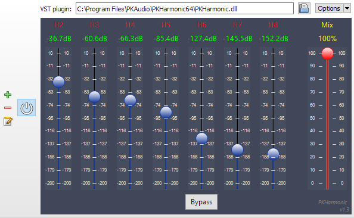

 
 

<a href="PKHarmonic64.zip">Download 64-bit PKHarmonic VST for Windows  </a> 
<a href="PKHarmonic64.zip">Download 32-bit PKHarmonic VST for Windows </a>

Support and feedback for PKHarmonic available at this <a href="https://www.audiosciencereview.com/forum/index.php?threads/announcing-beta-test-of-pkharmonic-vst-plugin.19063/post-624652">ASR thread.</a>

## You may also be interested in these:
* <a href="https://deltaw.org" target="_blank">DeltaWave</a> - Audio null analyzer and audibility tester
* <a href="https://distortaudio.org" target="_blank">DISTORT</a> - Your personal simulation of what various distortions do to audio
 
* <a href="https://distortaudio.org/earful.html">Earful </a> - An audiophile Hearing Test 

 
Use the PayPal Donate button below to help me develop this and other Audio software! Leave me a note with payment to indicate which software you're using, and anything else that you'd like to see written:
  
<form action="https://www.paypal.com/donate" method="post" target="_top">
<input type="hidden" name="hosted_button_id" value="79SK4HAQSSP3Q" />
<input type="image" src="https://www.paypalobjects.com/en_US/i/btn/btn_donateCC_LG.gif" border="0" name="submit" title="PayPal - The safer, easier way to pay online!" alt="Donate with PayPal button" />

</form>
 

## What is PKHarmonic?
PKHarmonic is a VST plugin for Windows, designed to add second and all the way up to the 8th harmonic by simulating a device non-linearity. A simple slider control for each harmonic lets you fine tune the level from -200dB to +10dB in real time, as you listen. This makes it possible to configure your playback software to generate similar levels of distortions to simulate a tube preamp or an amp, or another device with some level of non-linearity.  

Because PKHarmonic is a VST plugin, it works seamlessly with any software that can host VSTs (for example, JRiver MC, Foobar2000, Reaper, Audacity, Equalizer APO, etc.) Some apps only work with 32-bit plugins, so PKHarmonic is provided as both, 64-bit and 32-bit VST plugins. Use the one that's appropriate for your software (Foobar2000 for example, requires 32-bit VSTs).

## What does it cost?
I'm reluctant to place a price on PKHarmonic, although it did take a lot of time and effort to create. It was built using some of the technology I previously developed for DISTORT app, so a lot of work has gone into this for a number of years. Instead of asking for payment, I'm asking, instead, for a *donation*. You decide how much this is worth to you and use the <a href="https://www.paypal.com/donate?hosted_button_id=79SK4HAQSSP3Q&source=url">PayPal Donate button</a> above to send me some cash. This will help me support not just PKHarmonic, but also all the other Audio software that I've developed and will develop in the future. This will help me to continue to keep these free of charge (see <a href="https://distortaudio.org/earful.html">Earful</a>, <a href="https://deltaw.org">DeltaWave</a>, and <a href="https://distortaudio.org">DISTORT</a>) apps.

If PKHarmonic saves you money by replacing an expensive tube preamp that costs $5,000, a donation of 10% of the savings would not be that unreasonable :) But, give what you can and what you feel is right, all donations will be gratefully accepted and appreciated.

## Features
* Set any combinations of 2nd through 8th harmonics, while the music is playing
* Save configurations with specific harmonic combinations that you like and recall them by name
* Use Bypass button to switch between playback with and without PKHarmonic in the audio path to A/B compare the differences
* Works with 64- and 32-bit VST host applications
* Internal processing is using 64-bit floating point numbers for greater precision

## How to use
Install 64- or 32-bit (or both) versions of PKHarmonic on your PC. This will place them, by default, into: 

C:\Program Files\PKAudio\PKHarmonic64 for the 64-bit plugin, and  
C:\Program Files (x86)\PKAudio\PKHarmonic32 for the 32-bit plugin

Then, follow the instructions for your specific player software that supports VST to add it to the audio chain. If you use Equalizer APO, you can add PKHarmonic to all audio playback that EQ APO supports, regardless of the player.

## Changes in 1.0.1
* Initial public release of PKHarmonic VST Plugin

___

